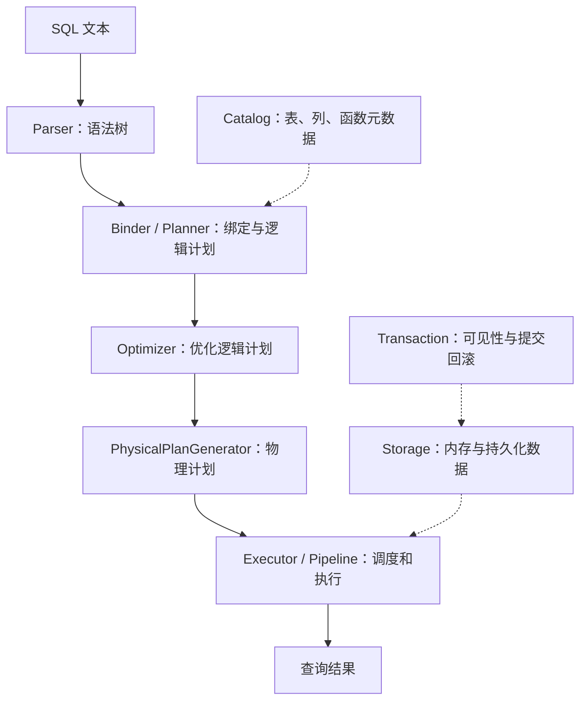

# DuckDB 系统学习计划

> 基于本地 `learning` 分支、提交 `d6b403d382` 制定，日期：2026-09-30。
> 默认具备基本编程经验，每周投入 6–8 小时，主线共 12 周（约 72–96 小时）。
> 目标是建立数据库内核的整体认识，能够追踪查询、解释关键设计，并独立完成一个小型本地改动及验证。

## 每周详细计划导航

下面每个文件都是一周的完整学习指南，包含四次学习安排、源码阅读问题、实验步骤与预期、自测题和验收清单。按顺序学习；开始每次实验前先看该页的环境与依赖说明。

| 周次 | 详细计划 | 本周主要产出 |
| --- | --- | --- |
| 01 | [环境、SQL 与测试](week-01-environment-and-tests.md) | 可运行环境、SQL 基线与测试记录 |
| 02 | [查询生命周期](week-02-query-lifecycle.md) | 从 SQL 到结果的阶段图与调用栈 |
| 03 | [类型、Vector 与 DataChunk](week-03-types-and-vectors.md) | 数据表示与选择向量示意图 |
| 04 | [Parser、Binder 与 Catalog](week-04-parser-binder-catalog.md) | 绑定路径与 SQL 错误分类 |
| 05 | [优化器](week-05-optimizer.md) | 优化规则前后对照实验 |
| 06 | [物理算子](week-06-physical-operators.md) | Source / Operator / Sink 数据流图 |
| 07 | [聚合与连接](week-07-aggregation-and-joins.md) | 算法状态图与边界输入结果 |
| 08 | [Pipeline 与并行](week-08-pipelines-and-parallelism.md) | 依赖图与受控性能比较 |
| 09 | [存储与缓冲](week-09-storage-and-buffers.md) | 扫描路径、存储信息和持久化校验 |
| 10 | [事务与恢复](week-10-transactions-and-recovery.md) | 双连接时间线与持久化机制说明 |
| 11 | [函数与扩展](week-11-functions-and-extensions.md) | 注册到执行的路径与函数行为规格 |
| 12 | [综合实践](week-12-capstone.md) | 有测试证据的本地练习改动 |

本文件保留整体路线；每周的操作细节以对应详细计划为准。源码调试、完整重编译、扩展构建等未执行项目均在各页说明，不把计划中的练习记为已完成。

## 1. 学习目标与安排

DuckDB 是一个可以嵌入应用的分析型数据库：接收 SQL，将其转换为执行计划，再以批量、列式的数据处理方式计算结果。

这次学习围绕五个问题展开：

1. 一条 SQL 如何从文本变成结果？
2. 数据在内存中如何表示，为什么要用向量和数据块？
3. 优化器、执行算子和并行调度如何协作？
4. 数据如何保存，事务如何保证可见性与恢复？
5. 如何给项目增加测试、定位问题并验证一个小改动？

完成主线后，应能交付：一张查询生命周期图、一份核心对象关系表、一组可重复的 SQL 实验、一次双连接事务实验，以及一个有测试证据的本地练习改动。存储压缩算法、完整优化器、分布式集成等留作后续专题。

### 预备知识自检

| 基础 | 达标标准 | 不熟悉时的补课任务 |
| --- | --- | --- |
| C++ | 能读懂类、继承、模板、引用、移动语义和智能指针 | 补 RAII（用对象生命周期管理资源）、`unique_ptr`、`std::move`，再阅读一个简单函数实现 |
| SQL | 能写过滤、聚合、连接、子查询，并解释 NULL | 在内存数据库中各写两个例子，先预测结果再执行 |
| 数据结构 | 理解哈希表、树、排序和基本时间复杂度 | 手画哈希连接的建表与探测过程 |
| 工具 | 会用 Git、CMake/Make、`rg`，能看调用栈 | 跑通第 1 周，再完成第 2 周的一次断点练习 |

缺少两项以上基础时，先安排 1–2 周预备学习；已有数据库内核经验时可压缩第 1–4 周。每周只有 3–4 小时，就把一个学习周拆成两个自然周。

### 每周固定节奏

- 1 小时：读已有测试、运行 SQL，写下本周要回答的问题。
- 2 小时：从入口函数阅读源码，只追踪与问题有关的分支。
- 2–3 小时：做实验、看计划或调用栈，核对自己的预测。
- 1–2 小时：整理笔记并完成验收；未通过就补实验，不按日历强行推进。

源码阅读顺序采用“测试 → 对外行为 → 头文件接口 → 关键实现 → 实验验证”。每周精读 2–3 个入口，其余文件只用于追踪调用关系。

## 2. 仓库地图与版本注意事项



这是学习用的数据流图，不代表一条固定、连续的调用栈；准备语句、任务调度和结果获取会跨越不同阶段。

| 关注点 | 阅读入口 | 首先回答的问题 |
| --- | --- | --- |
| 数据库与连接 | [database.cpp](../src/main/database.cpp)、[connection.cpp](../src/main/connection.cpp)、[client_context.cpp](../src/main/client_context.cpp) | 哪些状态属于数据库，哪些属于连接或单次查询？ |
| 语法解析 | [parser.cpp](../src/parser/parser.cpp)、[PEG 目录](../src/parser/peg/) | SQL 如何变成语句、表达式与表引用？ |
| 绑定与逻辑计划 | [planner.cpp](../src/planner/planner.cpp)、[binder.cpp](../src/planner/binder.cpp) | 列名何时变成有类型、可定位的引用？ |
| 优化 | [optimizer.cpp](../src/optimizer/optimizer.cpp) | 哪些变换减少数据量或计算量，同时保持语义？ |
| 物理计划 | [physical_plan_generator.cpp](../src/execution/physical_plan_generator.cpp) | 逻辑操作如何选择具体算法？ |
| 向量与数据块 | [vector.hpp](../src/include/duckdb/common/types/vector.hpp)、[data_chunk.hpp](../src/include/duckdb/common/types/data_chunk.hpp) | 一批数据的类型、行数、NULL 和选择索引存在哪里？ |
| 执行与并行 | [executor.cpp](../src/parallel/executor.cpp)、[pipeline_executor.cpp](../src/parallel/pipeline_executor.cpp) | 数据由谁产出、处理、消费，任务由谁调度？ |
| 存储 | [data_table.cpp](../src/storage/data_table.cpp)、[storage 目录](../src/storage/) | 表如何组织列、行组、内存块和磁盘块？ |
| 事务与目录 | [duck_transaction_manager.cpp](../src/transaction/duck_transaction_manager.cpp)、[catalog.cpp](../src/catalog/catalog.cpp) | 不同事务看到什么版本，名字怎样解析到对象？ |
| 函数与扩展 | [function 目录](../src/function/)、[extension 目录](../extension/) | 函数怎样注册、绑定并批量执行？ |

学习时注意当前仓库的实际情况：

- **解析器以源码为准。** 当前解析使用 PEG；普通查询可经 [ParseIterator](../src/main/parse_iterator.cpp) 逐条解析，并不保证调用 `Parser::ParseQuery`。[src/README.md](../src/README.md) 仍有 Postgres 解析器的旧描述。[PEG README](../src/parser/peg/README.md) 可参考语法规则，但其中部分目录说明也已落后；当前语法位于 `src/parser/peg/grammar/`。
- **向量 API 已更新。** 阅读旧实现时会遇到手动 selection/validity 循环；新练习遵循 [AGENTS.md](../AGENTS.md)：一般类型化读写使用 `Values<T>()` 和 `FlatVector::Writer<T>()`，逐元素标量函数优先使用执行器。类型擦除代码存在例外。
- **C++ 对外示例与内核对象要区分。** [main.cpp](../tools/cpp/example/main.cpp) 使用 `duckdb::cxx::Environment` 等稳定 API；内核主线中还会读到 `Connection`、`ClientContext`。该示例 README 的部分构建路径在当前仓库不存在，先读代码，构建留作可选任务。
- **路径可能随版本变化。** 每次记录实验都写上提交号；文件迁移后用 `rg` 搜索类名或函数名，不依赖固定行号。

## 3. 第一次学习：跑通查询和测试

以下命令均从仓库根目录执行。先记录环境：

```bash
git rev-parse --short HEAD
cmake --version
c++ --version
```

首轮源码构建使用项目推荐的 `reldebug`。需要 C++ 工具链、CMake、Make 和 Python；实际缺少的依赖以构建报错为准。构建时间不计入阅读时间，并行编译内存不足时降低并发：

```bash
CMAKE_BUILD_PARALLEL_LEVEL=4 make reldebug
```

已有本地构建时，可以先执行下列命令建立反馈，再在开始修改代码前重建：

```bash
build/reldebug/duckdb -c "SELECT 42 AS answer"
build/reldebug/test/unittest test/sql/order/test_limit.test
build/reldebug/test/unittest test/sql/filter/test_alias_filter.test
```

先跑指定测试文件。没有执行任何测试、因缺少扩展跳过，与真正通过不同。整个快速测试集的入口是 `build/reldebug/test/unittest`；包含慢测试的 `"*"` 不作为每日练习。

### 贯穿主线的 SQL

进入 `build/reldebug/duckdb`，在同一个会话中执行：

```sql
SET threads = 1;

CREATE TABLE orders (
    order_id INTEGER,
    customer_id INTEGER,
    amount INTEGER,
    status VARCHAR
);

INSERT INTO orders VALUES
    (1, 10, 120, 'paid'),
    (2, 10,  50, 'paid'),
    (3, 20,  80, 'pending'),
    (4, 20, 100, 'paid'),
    (5, 30, NULL, 'paid'),
    (6, 30,  20, 'paid');

SELECT customer_id, SUM(amount) AS total, COUNT(*) AS n
FROM orders
WHERE status = 'paid' AND amount >= 50
GROUP BY customer_id
ORDER BY total DESC, customer_id
LIMIT 5;
```

预期结果：

| customer_id | total | n |
| --- | --- | --- |
| 10 | 170 | 2 |
| 20 | 100 | 1 |

随后执行 `SET explain_output = 'all';`，分别在上述 SELECT 前加 `EXPLAIN` 与 `EXPLAIN ANALYZE`。前者观察计划，后者实际执行查询并提供运行信息。

练习分三步：先只做扫描过滤，再加聚合，最后加排序与 LIMIT。为每次变化画出计划，回答 NULL 行在哪一步被排除、过滤是否进入扫描、排序是否变成 Top N。实际算子会受数据、统计信息和版本影响，不把某个算子名称当作固定答案。

## 4. 十二周学习路线

### 第 1 周：建立使用与测试闭环

**目标：** 能运行项目、阅读执行计划和一个 SQL 测试。

- 阅读：[AGENTS.md](../AGENTS.md)、[test/README.md](../test/README.md)、[test_limit.test](../test/sql/order/test_limit.test) 前 60 行。
- 实践：完成上一节；理解 `statement ok`、`statement error`、`query` 和 `----`；运行 [test_explain.test](../test/sql/explain/test_explain.test)。
- 产出：环境记录、三张逐步增加操作的计划图、一次测试运行结果。
- **验收：** 能说明 SQL 测试验证什么，以及 `EXPLAIN` 和 `EXPLAIN ANALYZE` 的区别；能独立重跑某个测试文件。

### 第 2 周：追踪一条 SQL 的生命周期

**目标：** 把 SQL 到结果的各阶段映射到真实函数。

- 精读：[client_context.cpp](../src/main/client_context.cpp) 中 `Query`、`CreatePreparedStatementInternal`，以及 [planner.cpp](../src/planner/planner.cpp) 中 `Planner::CreatePlan`；将 eager 解析入口 `ParseStatementsInternal` 作为对照。
- 追踪：`ParseIterator::Peek` / PEG 解析 → `Planner::CreatePlan` → `Optimizer::Optimize` → `PhysicalPlanGenerator::Plan`；再从 `Executor::Initialize` 看执行阶段如何开始。
- 实践：用 `SELECT 42` 和主线查询各做一次断点追踪。macOS 可从 `lldb -- build/reldebug/duckdb -c "SELECT 42"` 启动，在 LLDB 中执行 `breakpoint set -n 'duckdb::ParseIterator::Peek'`、`run`、`thread backtrace`。符号不可用时先确认构建带调试信息；优化后的局部变量可能不可见。
- 产出：查询生命周期图，为每个节点标出输入、输出和源码位置；实际调用栈另外保存。
- **验收：** 能区分语法树、绑定后的表达式、逻辑计划和物理计划；不把阶段图误当成完整调用栈。

### 第 3 周：掌握类型、Vector 与 DataChunk

**目标：** 理解执行器处理的基本数据单位。

- 精读：[vector.hpp](../src/include/duckdb/common/types/vector.hpp)、[data_chunk.hpp](../src/include/duckdb/common/types/data_chunk.hpp)；按需查阅 [vector_iterator.hpp](../src/include/duckdb/common/vector/vector_iterator.hpp) 和 [vector_writer.hpp](../src/include/duckdb/common/vector/vector_writer.hpp)。
- 关注：`LogicalType`、`Value`、向量长度、Flat/Constant/Dictionary 表示、SelectionVector 与 NULL 有效性。向量化批处理与 SIMD 是不同层面的概念。
- 实践：分别查询整数、字符串、NULL、LIST、STRUCT；在调试器中检查一个 DataChunk 的列类型和行数。画出“过滤后选择原始行”的示意图，解释什么时候能引用数据而不复制。
- 产出：核心对象关系表，以及一个过滤前后 Vector/SelectionVector 的例子。
- **验收：** 能解释“逻辑第 i 行”与底层存储位置的区别，知道为什么不能把所有向量都当作连续、无 NULL 的数组。

### 第 4 周：Parser、Binder 与 Catalog

**目标：** 理解语法正确之后，数据库如何确定 SQL 的含义。

- 精读：[select.gram](../src/parser/peg/grammar/statements/select.gram)、[transform_select.cpp](../src/parser/peg/transformer/transform_select.cpp)、[bind_select_node.cpp](../src/planner/binder/query_node/bind_select_node.cpp) 中与主线查询有关的部分。
- 追踪：需要解析表名时进入 [bind_basetableref.cpp](../src/planner/binder/tableref/bind_basetableref.cpp) 和 Catalog；需要解析表达式时进入 [expression_binder.cpp](../src/planner/expression_binder.cpp)。
- 实践：构造语法错误、表不存在、列不存在、歧义列名、类型不匹配等例子；预测失败阶段，再核对错误和调用栈。运行 [test_alias_filter.test](../test/sql/filter/test_alias_filter.test)。
- 产出：一张“输入 SQL → 失败阶段 → 原因 → 处理函数”表。
- **验收：** 能解释 Parser 为什么无法独自判断列是否存在，以及 `ColumnBinding` 在后续计划中的作用。

### 第 5 周：优化器与计划变化

**目标：** 精读一条优化规则，理解它保持语义的条件。

- 精读：[optimizer.cpp](../src/optimizer/optimizer.cpp) 的流程和 [filter_pushdown.cpp](../src/optimizer/filter_pushdown.cpp) 的一个相关分支；排序优化可选读 [topn_optimizer.cpp](../src/optimizer/topn_optimizer.cpp)。
- 实践：先用 `SELECT * FROM duckdb_optimizers();` 查名称，再用 `SET disabled_optimizers = 'filter_pushdown';` 对比主线查询；实验后 `RESET disabled_optimizers;`。记录计划、结果与扫描过滤条件的差异。
- 加做：加入 NULL 和 LEFT JOIN，说明哪些过滤条件不能随意跨越连接移动。不要由一个例子推断所有变换都安全。
- 产出：一个优化前后对照案例，包含相同输入、查询结果和对应规则入口。
- **验收：** 能说明逻辑等价与执行成本是两个不同问题；若计划没有变化，能给出证据并进一步缩小例子。

### 第 6 周：物理算子与数据流

**目标：** 理解 Source、Operator、Sink 三类执行职责。

- 精读：[physical_operator.hpp](../src/include/duckdb/execution/physical_operator.hpp)、[physical_filter.cpp](../src/execution/operator/filter/physical_filter.cpp)、[physical_table_scan.cpp](../src/execution/operator/scan/physical_table_scan.cpp)。
- 追踪：Source 产出 DataChunk，普通算子处理数据，Sink 消费或积累数据；需要时进入 [expression_executor.cpp](../src/execution/expression_executor.cpp)。
- 实践：追踪一个确实包含 Filter 算子的计划，观察过滤全通过、部分通过和零行的情况。优化器可能消除 Filter 或把过滤推入扫描，先检查实际计划再设断点。
- 产出：一张带 DataChunk 行数变化的执行流程图，以及局部/全局状态的用途说明。
- **验收：** 能讲清 `PhysicalFilter::ExecuteInternal` 中 `Reference` 与 `Slice` 两条分支，以及空结果如何继续流转。

### 第 7 周：聚合与连接

**目标：** 理解两类常见分析查询的核心算法与状态。

- 精读：[physical_hash_aggregate.cpp](../src/execution/operator/aggregate/physical_hash_aggregate.cpp)、[physical_hash_join.cpp](../src/execution/operator/join/physical_hash_join.cpp) 的主要接口；遇到哈希表细节时只追当前问题。
- 实践：阅读并运行 [test_group_by.test](../test/sql/aggregate/group/test_group_by.test)；另建一个小客户表，与 orders 做 INNER/LEFT JOIN，加入重复键、NULL 键和无匹配行，预测行数后验证。
- 比较：`COUNT(*)` 与 `COUNT(amount)`、有无 GROUP BY、空输入、build/probe 两侧。小整数分组可能选用 Perfect Hash 聚合，先辨认实际计划，再决定追哪段代码。
- 产出：哈希聚合状态图、哈希连接两阶段图、至少四个边界输入的预期与实际结果。
- **验收：** 能解释重复键为什么扩大连接结果、NULL 如何影响计数，以及聚合为什么需要保存中间状态。

### 第 8 周：Pipeline、任务调度与并行

**目标：** 理解物理计划如何拆成可调度的工作。

- 精读：[pipeline.cpp](../src/parallel/pipeline.cpp)、[pipeline_executor.cpp](../src/parallel/pipeline_executor.cpp)、[task_scheduler.cpp](../src/parallel/task_scheduler.cpp) 的初始化、执行与调度入口。
- 实践：用 `range(1000000)` 生成有规律的数据，比较 `SET threads = 1` 与 `SET threads = 4` 下同一个聚合或连接查询。先预热，再各跑 5 次，记录中位数、输入行数和计划。
- 追踪：识别一个必须等待前置工作完成的边界，标出局部状态如何汇总、下游何时可以执行。
- 产出：一张 pipeline 依赖图与一份小型性能记录。
- **验收：** 能区分物理算子树与 pipeline 依赖图；结果一致，有证据解释为何小查询可能没有并行收益。

### 第 9 周：列式存储、行组与缓冲管理

**目标：** 将查询执行中的扫描连接到存储层。

- 精读：[table_scan.cpp](../src/function/table/table_scan.cpp)、[data_table.cpp](../src/storage/data_table.cpp)、[row_group.cpp](../src/storage/table/row_group.cpp) 中的扫描路径。
- 按需查阅：[column_data.cpp](../src/storage/table/column_data.cpp)、[standard_buffer_manager.cpp](../src/storage/standard_buffer_manager.cpp)，梳理列、行组、块与缓冲区的关系。
- 实践：使用专门的练习数据库文件建表、插入、退出并重新打开，核对行数和聚合值；比较只读取一列与多列的计划。此实验验证正常持久化，不代表验证了崩溃恢复。
- 产出：扫描到存储的调用路径图，以及一次持久化前后数据校验记录。
- **验收：** 能说明列式存储如何支持投影裁剪，区分内存引用、缓冲块与磁盘持久化。

### 第 10 周：事务、MVCC、WAL 与 Checkpoint

**目标：** 理解数据可见性与数据持久化分别由什么机制保证。

- 精读：[duck_transaction_manager.cpp](../src/transaction/duck_transaction_manager.cpp)、[undo_buffer.cpp](../src/transaction/undo_buffer.cpp)；按问题查阅 [write_ahead_log.cpp](../src/storage/write_ahead_log.cpp) 和 [checkpoint_manager.cpp](../src/storage/checkpoint_manager.cpp)。
- 实践：运行 [test_basic_transactions.test](../test/sql/transactions/test_basic_transactions.test)，使用其中 `con1`、`con2` 的方式画出 BEGIN、DDL、COMMIT/ROLLBACK、SELECT 时间线；再扩展到同一行的更新可见性。
- 加做：在专用练习数据库执行提交和 `CHECKPOINT`，重新打开后核对数据。崩溃注入与恢复完整性属于后续专题。
- 产出：一张双连接可见性表，说明 MVCC（多版本并发控制）、undo、WAL（预写日志）、checkpoint 各自解决什么问题。
- **验收：** 能预测已有事务与新事务的读结果，说明回滚与重启恢复的区别。双连接实验使用同一数据库实例中的连接或测试框架，不用两个独立 CLI 进程替代。

### 第 11 周：函数系统与扩展边界

**目标：** 沿一个短实现读通注册、绑定、向量化执行与测试。

- 精读：[json_valid.cpp](../extension/json/json_functions/json_valid.cpp) 和 [json_functions.cpp](../extension/json/json_functions.cpp) 中的注册入口；对照 [test_json_valid.test](../test/sql/json/scalar/test_json_valid.test) 前 60 行。
- 实践：测试合法 JSON、非法输入、空字符串、NULL；用仓库测试确定当前语义。缺少 JSON 扩展时先执行 `DUCKDB_EXTENSIONS='json' make reldebug`，随后运行指定测试，确认没有跳过。
- 不依赖扩展的替代练习：阅读 [length.cpp](../src/function/scalar/string/length.cpp)，比较字符串码点数、字节数与 NULL 的行为。
- 产出：一张“注册 → 重载绑定 → 执行器 → 结果”的函数调用图，以及输入边界清单。
- **验收：** 能解释逐元素函数为何适合使用 `UnaryExecutor` 等执行器，区分通用函数框架、具体实现和扩展加载。

### 第 12 周：完成一个有验证证据的小改动

**目标：** 独立走完理解、实现、验证和解释的过程。

从下面选一个题目，范围控制在单个行为或一个短实现：

1. **基础题：补足行为测试。** 为已理解的函数增加确实未覆盖的 NULL、类型或边界组合，说明现有测试为什么不足。
2. **标准题：修复一个小问题。** 从能稳定复现的 SQL 入手，先写失败测试，再做最小修复；不预设仓库一定存在适合当前水平的缺陷。
3. **进阶题：实现一个练习用标量函数。** 复用已有注册和执行模式，明确类型、NULL 与错误语义，只在本地练习分支完成。

步骤：写一页问题说明和验收条件 → 检查已有测试 → 补测试或构造失败用例 → 最小实现 → 重建与验证 → 对照 diff 解释每处变化。

**验收：** 能独立重跑全部相关测试；能给出行为变化、涉及阶段、边界条件、验证结果和已知限制。修复类任务必须有“修复前失败、修复后通过”的证据。最终产出是本地练习补丁及说明；对外贡献时另读 [CONTRIBUTING.md](../CONTRIBUTING.md) 的当前要求。

## 5. 实验与笔记方法

`week-*.md` 是已提供的学习指南；学习时再按需要建立自己的记录和实验文件：

```text
notes/
  learning-plan.md
  week-01-environment-and-tests.md
  ...                  # 每周独立指南，共 12 个
  week-12-capstone.md
  journal/             # 自己的周记、疑问和源码阅读记录
  experiments/          # SQL、计划输出和实验数据说明
  capstone/             # 最后的小改动说明与验证记录
```

每篇笔记使用同一个模板：

```markdown
# 本周主题
- 环境：提交号、构建配置、执行命令
- 问题：本周要回答的 1–3 个问题
- 预测：执行前预计看到什么
- 证据：源码路径与符号、测试或调用栈、实际 SQL 输出
- 解释：现象为什么发生，哪些只是当前假设
- 验收：已完成项与待补证据
- 下一步：一个具体问题
```

不要只摘抄源码。每条结论至少关联一个实际例子；性能结论还要记录数据规模、线程数、重复次数与构建配置。先保证查询结果一致，再解释性能差异。

### 常用定位与验证命令

```bash
# 按符号找实现，再看同主题测试
rg -n 'CreatePreparedStatementInternal|Planner::CreatePlan' src
rg -n 'class PhysicalFilter|PhysicalFilter::' src
rg --files test/sql | rg '(filter|aggregate|transactions)'

# 日常练习：重建后跑受影响文件
make reldebug
build/reldebug/test/unittest test/sql/filter/test_alias_filter.test
build/reldebug/test/unittest test/sql/transactions/test_basic_transactions.test

# 准备结束一个代码改动时，检查格式和差异
make format-fix
git diff --check
git diff --stat
```

纯阅读或修改笔记不需要重编数据库。修改代码后，先跑目标测试，再扩大到相关测试和快速测试集；完整提交验证按仓库要求执行 `make allunit`。涉及配置、向量或广泛内核行为时，再按 [AGENTS.md](../AGENTS.md) 执行对应的额外检查。格式化可能涉及更多文件，检查 diff，避免将无关变化混入练习。

新增 SQL 测试优先使用 `.test`；慢测试用 `.test_slow`；不要在新测试中添加 `PRAGMA enable_verification`。修改生成文件对应的源定义后再执行 `make generate-files`，不要直接把生成产物当作唯一修改入口。

## 6. 里程碑与继续学习方向

- [ ] **第 2 周结束：** 能用源码位置与调用栈讲清一条查询的主要阶段。
- [ ] **第 4 周结束：** 能解释数据表示、名字绑定和典型 SQL 错误来源。
- [ ] **第 8 周结束：** 能连接优化计划、具体算子、数据流与并行调度，并完成一次受控比较。
- [ ] **第 10 周结束：** 能用实验说明持久化与事务可见性，解释恢复机制的基本分工。
- [ ] **第 12 周结束：** 完成一个可重复验证的小改动；每个关键结论都有源码或实验依据。

通过主线后只选一个方向继续 4–6 周：优化器（连接顺序、统计信息、子查询）；执行引擎（哈希表、排序、窗口、内存受限执行）；存储事务（压缩、checkpoint、恢复测试）；函数扩展（复杂类型、绑定与外部格式）。先定一个可验证的问题，再扩展阅读范围。

## 7. 本计划制定时的校验记录

以下检查使用工作区中已有的 `build/reldebug` 产物，未重新完整构建，不据此宣称当前提交已通过全量验证：

- `test/sql/order/test_limit.test`：通过，115 个断言。
- `test/sql/filter/test_alias_filter.test`：通过，15 个断言。
- `test/sql/transactions/test_basic_transactions.test`：通过，16 个断言。
- 主线建表、插入、聚合 SQL 的结果与上面的预期一致；`explain_output='all'`、优化器枚举和 `filter_pushdown` 开关可以执行。
- 其余周任务属于待执行的学习实验；上述校验不代表整份学习计划已经完成。

分周详细版另外验证了聚合与连接边界、三个独立 Filter 计划、线程数对比脚本、正常持久化、双连接可见性及字符串测试样例。每页末尾记录各自验证范围；JSON 扩展当前不可用，其运行实验明确标为待执行。所有周文件、导航和本地源码链接均已检查。
